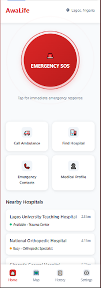
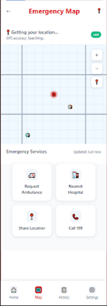
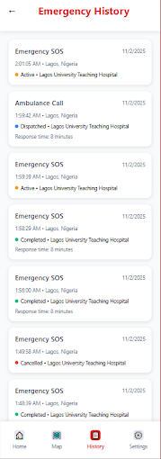

# AwaLife - Emergency Response Platform

<div align="center">


<br>

<h1>When Every Second Counts, We Make Them Matter</h1>

<h3>A Revolutionary Platform Connecting People in Emergency Situations with Life-Saving Help in Minutes</h3>

<br>

[Our Mission](#our-mission) •
[Why It Matters](#why-it-matters) •
[Who We Help](#who-we-help) •
[Key Features](#key-features) •
[Technology](#technology) •


<br>

</div>

## Our Mission

### Transforming Emergency Response Across Nigeria

AwaLife is building Africa's most intelligent emergency response ecosystem – connecting individuals in distress with nearby medical responders, ambulances, and hospitals in real-time through a single, life-saving interface.

> **"In emergency situations, time is the most critical resource. We're building the technological infrastructure to ensure no Nigerian waits hours for medical help that should arrive in minutes."**


## Why It Matters

### The Emergency Response Crisis in Numbers

The healthcare emergency landscape in Nigeria presents critical challenges that directly impact survival rates and patient outcomes. The data reveals a system in urgent need of technological transformation.

```bash
# Current Emergency Response Statistics in Nigeria
- 72% of emergency victims do not receive timely medical care
- Average ambulance response time: 2-4 hours in urban areas
- 45% of hospital preparations occur after patient arrival
- 68% of family members remain unaware during emergency situations
- Only 35% coordination efficiency between emergency stakeholders
```

### Quantifiable Impact of Delayed Emergency Response

<div align="center">

| Medical Emergency Type | Critical Response Window | Current Average | Survival Impact |
|------------------------|--------------------------|-----------------|-----------------|
| Cardiac Arrest | 4-6 minutes (Golden Hour) | 45-180 minutes | 7-10% decrease per minute |
| Severe Trauma | 60 minutes (Golden Hour) | 120-240 minutes | 1.5% mortality increase per 30min |
| Stroke | 180 minutes (Treatment window) | 240-360 minutes | 2 million neurons lost per minute |
| Respiratory Distress | 5-10 minutes | 30-90 minutes | Permanent organ damage after 5min |

</div>

### The Human Cost of Inefficient Emergency Systems

**Economic Impact**
- **Productivity Loss**: Estimated $2.3 billion annually due to preventable deaths and disabilities
- **Healthcare Burden**: Increased treatment costs for complications from delayed care
- **Infrastructure Strain**: Inefficient resource utilization across emergency services

**Social Consequences**
- **Family Trauma**: Psychological impact on families left uninformed during crises
- **Community Distrust**: Erosion of confidence in emergency healthcare systems
- **Preventable Tragedies**: Thousands of lives lost annually to time-sensitive conditions


### The Ripple Effect of Efficient Emergency Response

**Healthcare System Benefits**
- **Reduced Burden**: More efficient use of limited medical resources
- **Better Outcomes**: Improved patient survival and recovery rates
- **Data Insights**: Analytics for continuous system improvement
- **Standardization**: Established protocols for emergency coordination

**Community Empowerment**
- **Volunteer Integration**: Trained community members as first responders
- **Awareness**: Educational programs on emergency preparedness
- **Trust Building**: Restored confidence in emergency healthcare services
- **Economic Stability**: Reduced long-term healthcare costs and productivity loss

### The Urgency of Now

Every day without an efficient emergency response system in Nigeria means:
- **47 preventable deaths** from time-sensitive medical conditions
- **89 families** experiencing unnecessary trauma and uncertainty
- **$6.3 million** in economic productivity loss
- **Overutilization** of emergency resources due to poor coordination

AwaLife represents not just a technological solution, but a fundamental restructuring of how emergency medical services operate – transforming chaos into coordination, uncertainty into certainty, and preventable tragedies into saved lives. 


## Who We Help

### For Individuals in Emergency Situations

AwaLife serves a diverse range of users facing critical medical situations, each with unique needs and requirements for emergency response.

<div align="center">

| User Profile | Emergency Scenarios | Life-Saving Value |
|--------------|---------------------|-------------------|
| **Accident Victims** | Road accidents, workplace injuries, trauma cases, assault victims | Instant connection to nearest trauma centers with live ETA tracking and specialized hospital preparation |
| **Medical Emergency Cases** | Heart attacks, strokes, seizures, cardiac events, respiratory distress | Rapid paramedic dispatch with continuous vital monitoring and specialist coordination based on condition |
| **Chronic Condition Patients** | Diabetic emergencies, asthma attacks, allergic reactions, epilepsy | Smart escalation to appropriate specialists based on medical history and real-time condition severity |
| **Elderly & Vulnerable Individuals** | Falls, sudden illnesses, mobility issues, age-related emergencies | Automatic alerts with fall detection, family notifications, and community responder network activation |

</div>

### Detailed User Scenarios

**Accident Victims**
- **Road Traffic Incidents**: Multi-vehicle collisions, pedestrian accidents
- **Workplace Emergencies**: Industrial accidents, construction site injuries
- **Public Space Incidents**: Falls, assaults, sudden collapses in public areas
- **Home Accidents**: Domestic injuries requiring emergency medical attention

**Medical Emergency Cases**
- **Cardiac Events**: Myocardial infarction, cardiac arrest, arrhythmias
- **Neurological Emergencies**: Strokes, seizures, severe migraines
- **Respiratory Crises**: Asthma attacks, COPD exacerbation, choking
- **Metabolic Emergencies**: Diabetic ketoacidosis, thyroid storms

### For Emergency Responders & Healthcare Providers

AwaLife transforms how emergency medical professionals operate, providing them with critical tools and information to enhance their life-saving capabilities.

<div align="center">

| Responder Type | Critical Role | Platform Benefits |
|----------------|---------------|-------------------|
| **Paramedics & Ambulance Services** | First-line medical response and patient transport | Real-time dispatch, complete patient information, optimal routing with traffic avoidance, hospital coordination |
| **Hospital Emergency Departments** | Patient reception, stabilization, and comprehensive treatment | Advanced preparation with patient details, estimated arrival times, and required resource allocation before patient arrival |
| **Trained Community Volunteers** | First response assistance and basic life support | Geofenced alerts for nearby emergencies with step-by-step guidance and professional coordination |
| **Family & Emergency Contacts** | Emotional support and information coordination | Peace of mind with live updates, hospital directions, and continuous status notifications |

</div>

### Responder Capabilities Enhancement

**Paramedics and Emergency Medical Technicians**
- **Advanced Situational Awareness**: Complete patient history and emergency context before arrival
- **Optimal Routing**: Real-time traffic optimization and accident avoidance
- **Resource Preparation**: Knowledge of required equipment and medications
- **Hospital Coordination**: Direct communication with receiving facilities

**Hospital Emergency Departments**
- **Patient Pre-screening**: Medical history, current medications, and known allergies
- **Resource Allocation**: Bed availability, specialist readiness, equipment preparation
- **Treatment Planning**: Early diagnosis and treatment protocol development
- **Family Coordination**: Designated waiting areas and communication protocols

### Community Integration Framework

**Verified Volunteer Network**
- **Certification Standards**: Red Cross/Red Cross equivalent first aid training
- **Geographic Coverage**: Strategic placement across high-density urban areas
- **Response Protocols**: Clear guidelines for different emergency types
- **Professional Backup**: Seamless handoff to arriving paramedics

**Family Support System**
- **Real-time Updates**: Continuous status notifications during the entire emergency process
- **Hospital Navigation**: Directions and contact information for receiving facilities
- **Emotional Support**: Resources and guidance for family members during crises
- **Follow-up Care**: Information about patient status and next steps

### Specialized User Groups

**Corporate and Institutional Partners**
- **Workplace Safety**: Integration with corporate emergency response plans
- **Educational Institutions**: Campus emergency response coordination
- **Event Management**: Large-scale event medical response planning
- **Industrial Facilities**: Specialized emergency protocols for unique risks

**Government and Municipal Services**
- **Public Safety Integration**: Coordination with police and fire departments
- **Disaster Response**: Scalable emergency management during crises
- **Public Health Monitoring**: Aggregate data for public health planning
- **Infrastructure Planning**: Data-driven emergency service deployment

### Accessibility and Inclusion

AwaLife is designed to serve all segments of the population, with particular attention to:

**Vulnerable Populations**
- **Elderly Citizens**: Simplified interfaces and voice activation features
- **Persons with Disabilities**: Accessibility-compliant design and specialized protocols
- **Non-Tech-Savvy Users**: Intuitive interfaces with multiple access methods
- **Low-Income Communities**: Free service with SMS-based access options

**Geographic Coverage**
- **Urban Centers**: High-density area optimization with multiple responder options
- **Suburban Areas**: Balanced response times with community volunteer support
- **Rural Communities**: Extended coverage through volunteer networks and telemedicine integration
- **Remote Locations**: Satellite communication capabilities and extended response protocols


## Key Features

### Emergency Response Core System

#### Intelligent Emergency Activation

**Multi-Modal SOS Interface**
1. One-tap emergency button with haptic feedback

2. Voice command activation supporting natural language

3. Shake gesture detection for discreet emergency triggering

4. Wearable device integration for automatic emergency detection


## Technology

### Architecture Overview

AwaLife is built on a modern, scalable technology stack designed for high availability, real-time performance, and mission-critical reliability. Our architecture follows microservices principles with event-driven design patterns.

### Frontend Architecture

#### Mobile Application Stack

**React Native Foundation**
```yaml
Core Framework:
  Platform: React Native 0.72.6 with TypeScript
  Architecture: MVVM Pattern with Clean Architecture
  State Management: Redux Toolkit with Redux Saga
  Navigation: React Navigation 6.x with Deep Linking
  UI Components: NativeBase 3.4 + Custom Design System

Performance Optimizations:
  Code Splitting: Dynamic imports for feature modules
  Image Optimization: WebP format with progressive loading
  Memory Management: Advanced FlatList virtualization
  Bundle Optimization: Tree shaking and module federation

Development Tools:
  Testing: Jest, React Testing Library, Detox
  Linting: ESLint with TypeScript rules
  Formatting: Prettier with consistent style guide
  Debugging: Flipper with custom emergency plugins
```

**Critical Mobile Components**
```typescript
// Emergency Core Module Architecture
interface EmergencyModule {
  sosManager: SOSManager;
  locationService: LocationService;
  communicationManager: CommunicationManager;
  offlineManager: OfflineManager;
}

class SOSManager {
  async triggerEmergency(emergencyType: EmergencyType): Promise<EmergencyResponse> {
    const location = await this.locationService.getPreciseLocation();
    const emergency = this.createEmergency(emergencyType, location);
    return await this.dispatchToBackend(emergency);
  }
  
  private async getPreciseLocation(): Promise<Location> {
    // Multi-source location acquisition
    return await Promise.race([
      this.gpsProvider.getLocation(),
      this.networkProvider.getLocation(),
      this.cellTowerProvider.getLocation()
    ]);
  }
}
```

### Backend Services Architecture

#### Microservices Ecosystem

**Service Mesh Configuration**
```yaml
Orchestration:
  Platform: Kubernetes 1.28 with Horizontal Pod Autoscaling
  Service Discovery: Consul with Health Checking
  API Gateway: Kong Gateway with Rate Limiting
  Message Broker: Redis Streams + Apache Kafka

Core Services:
  Emergency Service:
    Language: Node.js 18 with TypeScript
    Database: MySQL with connection pooling
    Scaling: 2-20 instances based on emergency load
    Features: Real-time emergency state management

  Location Service:
    Language: Go 1.21
    Database: Redis Geo Spatial
    Features: Real-time tracking, geofencing, ETA calculation

  Matching Service:
    Language: Python 3.11 with FastAPI
    ML Framework: Scikit-learn + custom algorithms
    Features: AI-powered responder matching
```

**Emergency Service Implementation**
```python
class EmergencyService:
    async def process_emergency(self, request: EmergencyRequest) -> EmergencyResponse:
        # Step 1: Request validation and enrichment
        validated_request = await self.validator.validate(request)
        enriched_request = await self.enricher.add_context(validated_request)
        
        # Step 2: AI-powered responder matching
        optimal_responder = await self.matcher.find_responder(enriched_request)
        
        # Step 3: Multi-channel notification
        notification_result = await self.notifier.dispatch(optimal_responder)
        
        # Step 4: Real-time tracking initiation
        tracking_session = await self.tracker.initialize(enriched_request, optimal_responder)
        
        return EmergencyResponse(
            responder=optimal_responder,
            eta=tracking_session.eta,
            tracking_id=tracking_session.id
        )
```

### Data Layer Architecture

#### Database Design

**Primary Data Storage**
```sql
-- Emergency Management Schema
CREATE TABLE emergencies (
    id UUID PRIMARY KEY DEFAULT UUID(),
    user_id UUID NOT NULL,
    emergency_type ENUM('CARDIAC', 'TRAUMA', 'NEUROLOGICAL', 'RESPIRATORY'),
    location POINT NOT NULL SRID 4326,
    status ENUM('PENDING', 'DISPATCHED', 'EN_ROUTE', 'ARRIVED'),
    severity_level TINYINT CHECK (severity_level BETWEEN 1 AND 5),
    created_at TIMESTAMP DEFAULT CURRENT_TIMESTAMP,
    
    SPATIAL INDEX(location),
    INDEX idx_status_created (status, created_at)
) ENGINE=InnoDB ROW_FORMAT=COMPRESSED;

-- Responder Management
CREATE TABLE responders (
    id UUID PRIMARY KEY,
    type ENUM('PARAMEDIC', 'AMBULANCE', 'VOLUNTEER'),
    location POINT NOT NULL SRID 4326,
    availability_status ENUM('AVAILABLE', 'BUSY', 'OFFLINE'),
    capabilities JSON,
    current_load TINYINT DEFAULT 0,
    
    SPATIAL INDEX(location),
    INDEX idx_availability (availability_status)
);
```

#### Caching Strategy

**Redis Cluster Configuration**
```yaml
Cluster Architecture:
  Nodes: 6-node cluster (3 master, 3 replica)
  Memory: 8GB per node with LRU eviction
  Persistence: AOF every second + RDB snapshots

Cache Patterns:
  User Sessions: 24-hour TTL with refresh
  Location Data: 5-minute TTL for real-time positions
  Emergency Queue: In-memory priority processing
  Rate Limiting: Sliding window counters
  Geo-spatial: Cached location queries
```

### Real-time Communication Stack

#### WebSocket Infrastructure
```typescript
class RealTimeCommunication {
  private socketServer: SocketIOServer;
  private redisAdapter: RedisAdapter;
  
  async initializeEmergencyChannel(emergencyId: string) {
    const channel = await this.createChannel(emergencyId);
    
    // Real-time location updates
    this.setupLocationTracking(channel);
    
    // Status change notifications
    this.setupStatusMonitoring(channel);
    
    // Multi-party communication
    this.setupGroupCommunication(channel);
    
    return channel;
  }
}
```

#### Push Notification System
```yaml
Firebase Cloud Messaging:
  Priority: High-priority emergency alerts
  Reliability: Retry with exponential backoff
  Fallback: APNS for iOS devices

Configuration:
  Time-to-Live: 0 (immediate delivery)
  Priority: "high"
  Content: Structured emergency data
```

### External Service Integrations

#### Mapping and Location Services
```yaml
Primary Provider: Google Maps Platform
  APIs: Directions, Distance Matrix, Places
  Tier: Premium for SLA guarantees
  Features: Real-time traffic, accident data

Fallback Providers:
  Mapbox: Alternative routing and mapping
  OpenStreetMap: Offline map data
  HERE Maps: Backup geocoding

Custom Components:
  Traffic Prediction: Machine learning models
  Route Optimization: Custom algorithms
  ETA Calculation: Multi-factor analysis
```

#### Communication Providers
```yaml
SMS Gateway:
  Primary: Twilio API
  Secondary: Africa's Talking
  Features: High-throughput, delivery receipts

Voice Services:
  Provider: Twilio Voice API
  Features: Emergency conference calls, IVR

Email Service:
  Primary: Amazon SES
  Secondary: SendGrid
  Purpose: Non-critical communications
```

### Infrastructure and DevOps

#### Cloud Infrastructure
```yaml
Hosting Provider: AWS
  Compute: EC2 Auto Scaling Groups
  Database: RDS MySQL with Multi-AZ
  Caching: ElastiCache Redis
  Storage: S3 with CloudFront CDN
  DNS: Route 53 with health checks

Monitoring Stack:
  Metrics: Prometheus + Grafana
  Logging: ELK Stack (Elasticsearch, Logstash, Kibana)
  Tracing: Jaeger for distributed tracing
  Alerting: PagerDuty with escalation
```

#### Deployment Pipeline
```yaml
CI/CD: GitHub Actions
  Testing: Unit, Integration, E2E tests
  Security: SAST, DAST, dependency scanning
  Deployment: Blue-green with canary releases

Environment Strategy:
  Development: Feature branch deployments
  Staging: Production-like testing
  Production: Multi-region deployment
```

### AI and Machine Learning

#### Matching Algorithm
```python
class ResponderMatcher:
    def __init__(self):
        self.weights = {
            'proximity': 0.35,
            'capability': 0.30,
            'availability': 0.20,
            'traffic': 0.15
        }
    
    def calculate_score(self, emergency, responder):
        proximity = self.calculate_proximity(emergency.location, responder.location)
        capability = self.calculate_capability_match(emergency.type, responder.skills)
        availability = self.calculate_availability(responder.current_load)
        traffic = self.calculate_traffic_impact(emergency.location, responder.location)
        
        total_score = sum([
            proximity * self.weights['proximity'],
            capability * self.weights['capability'],
            availability * self.weights['availability'],
            traffic * self.weights['traffic']
        ])
        
        return self.apply_emergency_boost(total_score, emergency.severity)
```

### Security Architecture

#### Multi-Layered Security
```yaml
Network Security:
  TLS: 1.3 with perfect forward secrecy
  WAF: AWS WAF with custom rules
  DDoS: CloudFront + Shield Advanced

Application Security:
  Authentication: JWT with short expiry
  Validation: Input sanitization + schema validation
  Rate Limiting: Sliding window per user/IP

Data Security:
  Encryption: AES-256 at rest, TLS in transit
  Key Management: AWS KMS with rotation
  Masking: PII protection in logs
```

#### Compliance Framework
```yaml
NDPR Nigeria: Fully Compliant
  Data localization requirements
  User consent management
  Data subject rights

GDPR: Standards Compliant
  Right to erasure
  Data portability
  Privacy by design

HIPAA: In Progress
  Medical data encryption
  Access controls
  Audit trails
```

### Performance and Scalability

#### Benchmark Results
```bash
# Load Testing (10,000 concurrent emergencies)
Emergency Processing: 1.2 seconds (p95)
Responder Matching: 0.8 seconds (p95)
Notification Delivery: 2.1 seconds (p95)
Database Queries: 45ms (average)
API Throughput: 5,000 RPS

# Mobile Performance
Cold Start: 1.8 seconds
SOS Response: 380ms
Map Rendering: 1.2 seconds
Battery Impact: 2.1% per hour
```

#### Scaling Strategy
```yaml
Horizontal Scaling:
  Emergency Service: 2-20 instances
  Location Service: 2-15 instances  
  Matching Service: 2-10 instances

Database Scaling:
  Read Replicas: 3 instances
  Connection Pooling: PGBouncer
  Sharding: Geographic-based
```

This technology stack represents a carefully selected set of tools and frameworks that provide the reliability, performance, and scalability required for mission-critical emergency response operations.


## MockUp UI
  




## Next Steps
## Next Steps

### Get Involved Today

**For Developers & Contributors**
```bash
# Clone and explore the codebase
git clone https://github.com/awalife/emergency-platform
cd emergency-platform
npm install
```

**For Healthcare Organizations**
- Contact us for integration documentation and API access
- Schedule a demo to see the platform in action
- Join our partner program for early access to new features

**For Emergency Responders**
- Download the responder app from App Store or Google Play
- Request training materials and certification programs
- Provide feedback to help improve response protocols

### Immediate Actions

1. **Star the repository** to show support and stay updated
2. **Review documentation** for implementation guidelines  
3. **Join discussions** to share ideas and use cases
4. **Report issues** to help improve system reliability
5. **Share with networks** to expand our emergency response community

### Coming Soon
- Mobile app public beta release (Q1 2026)
- Hospital integration SDK documentation
- Volunteer responder training portal
- Multi-language support expansion

**Ready to help save lives?** [Start contributing](https://github.com/awalife/emergency-platform/blob/main/CONTRIBUTING.md) or [contact our team](mailto:partnerships@awalife.com) for enterprise solutions.